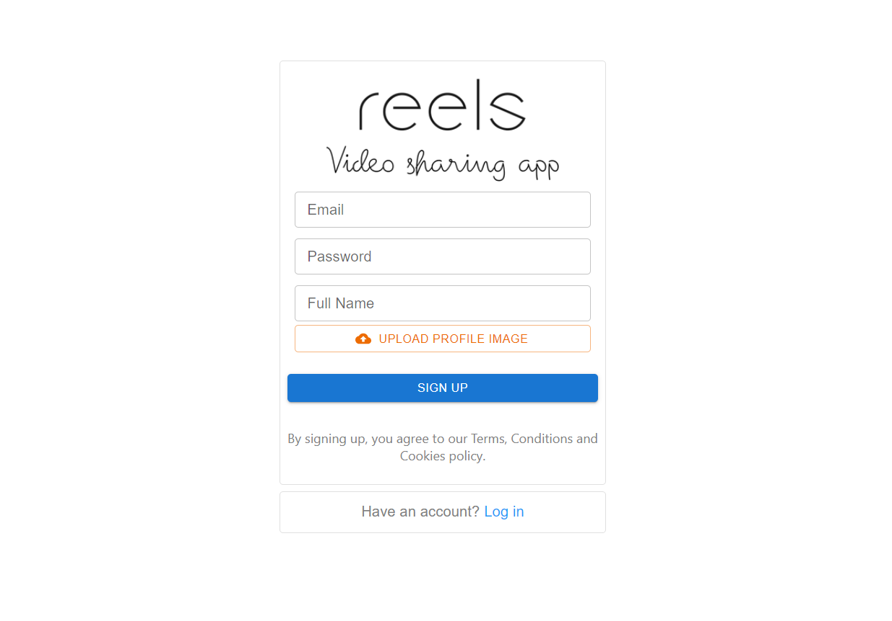
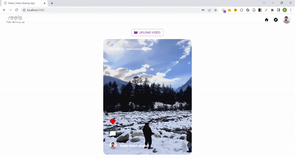
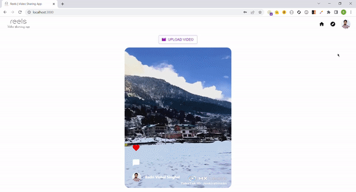

# Reels | Video Sharing App

Reels is a social media platform that allows you to upload short videos, like posts uploaded by other users and comment on them.


## Demo

https://reels-48980.web.app/

## Tech Stack

**Frontend:** React, Material UI

**Backend:** Firebase


## Features

- Login, Signup and Forgot password
- Post a short video
- Like and Comment on a post 
- Click on video to mute and unmute
- Profile page to see all the posts you have made


## Screenshots

 **Login Page: -**


 **Signup Page: -**



 **Forgot Password Page: -**


 **Home Page: -**



 **Profile Page: -**



## Run Locally

Clone the project

```bash
  git clone [repo url]
```

Go to the project directory

```bash
  cd [project-name]
```

Install dependencies

```bash
  npm install
```

Start the server

```bash
  npm  start
```
